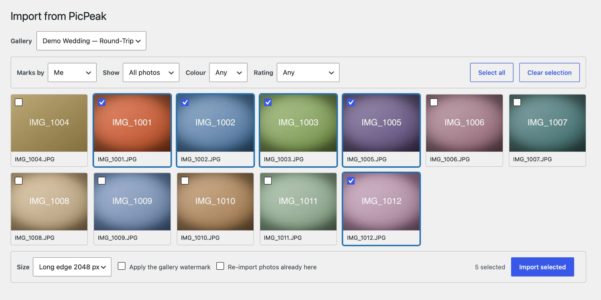
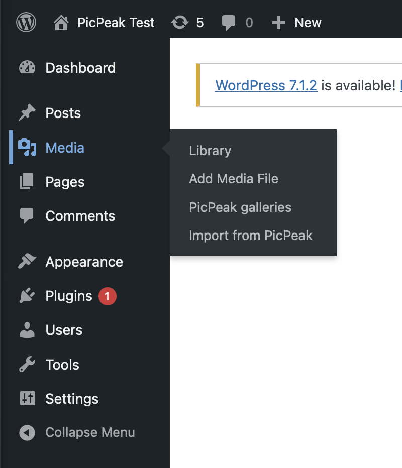
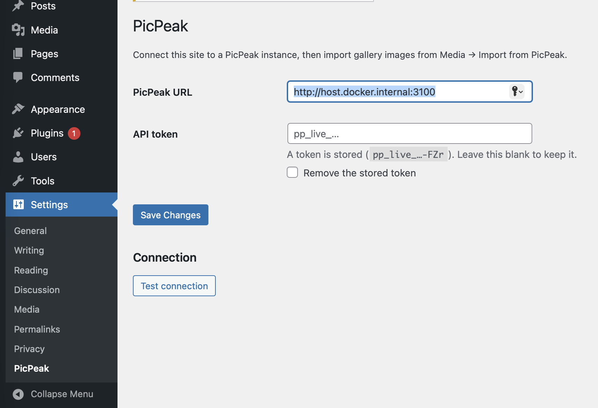

# PicPeak for WordPress

Import gallery images from a [PicPeak](https://github.com/PicPeak/picpeak) instance
into the WordPress media library.

Connect the plugin once with an API token, browse your galleries from inside
wp-admin, and import a whole gallery or a hand-picked selection — with the
proofing metadata PicPeak already holds carried across.

> **Status: early but working.** Connection, gallery browser and import all work,
> and the import path has been run end to end against a live PicPeak instance.
> The folder adapters have not. See [Roadmap](#roadmap).



## Why import rather than embed

PicPeak galleries expire by design. Hotlinking them into posts ties your site's
lifetime to the gallery's, and eventually serves 404s where your portfolio used
to be. Imported images live in your media library, with WordPress thumbnail
sizes, alt text and media search, and outlive the gallery they came from.

## Requirements

- WordPress 6.0+, PHP 7.4+
- A PicPeak instance you administer
- An API token from **Settings → Integrations** in PicPeak, with the `read`
  scope; its owning account needs the photo view and download permissions

### PicPeak version

The connection and gallery listing work against any PicPeak with the v1 API.

The picker and importer additionally need the preview and rendition endpoints
from [PicPeak/picpeak#1628](https://github.com/PicPeak/picpeak/pull/1628), which
is not merged yet:

| Needs | Endpoint |
|---|---|
| Thumbnails in the picker | `GET /api/v1/events/:id/photos/:photoId/preview` |
| Web-sized imports | `?resolution=WxH` on the download routes |
| Deciding how to fetch a row | `size_bytes` / `media_type` / `mime_type` on the photo list |

Importing originals one at a time, and the bulk ZIP, work on current PicPeak
without that PR.

## Where it appears

The plugin adds no top-level menu. After activating, it is in the two places
WordPress puts things of each kind:

- **Settings → PicPeak** — the instance URL and API token. Start here.
- **Media → Import from PicPeak** — the gallery browser and importer.

Both are also linked from the plugin's own row on the Plugins screen.



Connect it once under **Settings → PicPeak**. **Test connection** reports how
many galleries the token can actually see, so an empty result is an answer
rather than an ambiguous silence:



## Installation

Download `picpeak.zip` from [Releases](../../releases), then **Plugins → Add New →
Upload Plugin**. The zip contains a single top-level folder named `picpeak`,
which is what WordPress expects and what the text domain loads from.

On hosts that set `DISALLOW_FILE_MODS` the upload form is hidden; unpack into
`wp-content/plugins/picpeak/` over SFTP, or use `wp plugin install ./picpeak.zip --activate`.

## The token never reaches the browser

The API token is admin-scoped on the PicPeak side. Anything that could read it
from a page — another plugin, a browser extension, an XSS — would inherit that
access, so it is never printed back into the settings form and never handed to
JavaScript.

The picker calls a `picpeak/v1` namespace on **this** site; WordPress attaches
the token server-side. Those routes require the `upload_files` capability and a
REST nonce, and forward only the query parameters PicPeak documents.

### Who can import

The routes are gated on `manage_options` — administrators only — and **not** on
`upload_files`, which Authors hold. This is deliberate. WordPress cannot narrow
the PicPeak token: it carries the permissions of the admin who created it, so
anyone who can call these routes can list every gallery that account can see and
pull down originals. On a site with contributors, `upload_files` would hand one
photographer's private client galleries to anyone who can write a post — and
imported files land in `wp-content/uploads`, which is served without
authentication.

Widen it only if you mean to:

```php
add_filter( 'picpeak_required_capability', fn() => 'upload_files' );
```

### Self-hosting PicPeak on a local network

Because every request carries the token, the instance URL is refused if it
resolves to a private or loopback address. If your PicPeak genuinely is on a
LAN, allow it explicitly:

```php
add_filter( 'picpeak_reject_unsafe_urls', '__return_false' );
```

To keep the token out of the database entirely, define it in `wp-config.php`:

```php
define( 'PICPEAK_BASE_URL', 'https://gallery.example.com' );
define( 'PICPEAK_API_TOKEN', 'pp_live_…' );
```

The settings fields then render as locked rather than silently ignoring input.

## Resizing

Resizing happens **on the PicPeak server**, before anything is transferred, so
only the resized bytes cross the wire. Importing a 400-photo gallery at 2048 px
moves a fraction of what the originals would.

Sizes are given as the **longest edge**, the way an export dialog puts it. The
photo is fitted inside that box with its aspect ratio kept and is never
enlarged, so a 3000×2000 landscape at 2048 comes back 2048×1365. Presets cover
2048, 1600 and 1200 px; `Custom…` takes any value up to 99999.

Two things are served at original size whatever you pick, because re-encoding
them would produce bytes that disagree with their own filename and content type:

- **videos** (excluded from the picker by default anyway)
- **RAW and HEIC/HEIF**

A photo already smaller than the box is sent as stored rather than re-encoded.

## Folders

WordPress core has no media folders, so every import is tagged with a
`picpeak_gallery` term — that is what the filter dropdown in the media library
uses, and it needs no other plugin.

If **FileBird** or **Real Media Library** is active, imports are additionally
placed in a folder named after the gallery. This is detected at runtime; with
neither installed nothing is attempted and nothing is missing.

> **Not yet verified against a live install.** Both adapters are written against
> those plugins' documented APIs but have not been run with either plugin
> present. If an API has moved, the import still succeeds and the image is still
> tagged — and the screen now says how many could not be placed, rather than
> leaving you to notice an empty folder tree. Treat this as the least-proven
> part of the plugin.

Rename the folder with a filter:

```php
add_filter( 'picpeak_folder_name', fn( $name, $event ) => 'Shoots/' . $name, 10, 2 );
```

## Roadmap

- [x] Connection settings, credential handling, REST proxy
- [x] Gallery browser: thumbnail grid with PicPeak's own proofing filters
      (`marked_only`, `color_labels`, `min_rating`) — so "import what the client
      starred" is one control
- [x] Import: batched sideload, deduplicated on the PicPeak photo id, with a
      resolution choice and an optional watermark
- [x] A `picpeak_gallery` taxonomy on attachments, giving a filter dropdown in
      the media grid with no folder plugin involved
- [x] Optional folder-plugin adapters (FileBird, Real Media Library) — written,
      not yet run against either plugin
- [x] Release zip built by CI, named `picpeak/` as WordPress requires
- [ ] Updates through GitHub Releases (Plugin Update Checker)
- [ ] German translation
- [x] Import path tested end to end against a live instance
- [ ] Browser UI exercised in a real admin session

Import only. Nothing is written back to PicPeak.

Tracked upstream in [PicPeak/picpeak#1620](https://github.com/PicPeak/picpeak/issues/1620).

## License

MIT. See [LICENSE](LICENSE).
